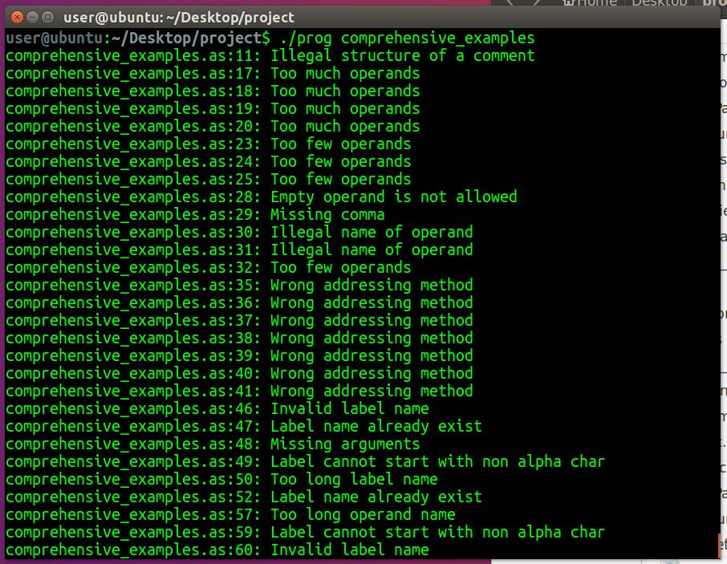

# 2 Passages Assembler

Name: Nadav Rosenberg 
Date: 22.8.2020

## General Explanation:
I built an assembler with 2 passages where the first pass checks semantics and logic errors and the second pass converts
the lines to the desired shape (and fills in the new files we created). Throughout the project I tried to document and
also gave significant names to variables, functions and files.

## Explanation of the files:
* ***assembler.c*** - goes through all the files and each time activates the passages, frees up memory, deletes 
unnecessary files and more.
* ***firstPass.c*** - implements the first passage.
* ***secondPass.c*** - implements the second passage.
* ***linefunc.c*** - contains the extractor and simple_extractor methods (and other utilities methods for them) which 
decompose a sentence into a label, an action and an operand.
* ***utilities.c*** - contains all the utilities methods needed including handling the data structures we have defined.
* ***validation.c*** - contains functions for checking validity (name of label, number of operands and more).
* ***prints.c*** - contains the method that prints errors and the method that prints a decomposed line (a line that 
passed the extractor or simple_extractor).
* ***files.c*** - handles everything related to files (opening, closing and more).
* ***basic.h*** - contains all the includes, defines, usable structures, global variables, and signatures of common functions.
* ***advanced.h*** - contains more complex functions that are not required throughout the program.

## Running examples:
* ***ps.as*** - identical to the one in the course booklet. 
* ***comprehensive_examples.as*** - contains examples of everything I needed to implement (ignoring spaces, 
correcting labels and more). 
* ***valid_example.as*** - contains a standard program.

NOTICE: The files ***ps*** and ***valid_example*** with the extension ob, ent, and ext are the result of running the 
program on the prog program.

NOTICE: ***Comprehensive_examples.as*** file does not have these files because it contains a lot of errors. This is the 
screenshot of the errors received by the prog program:

